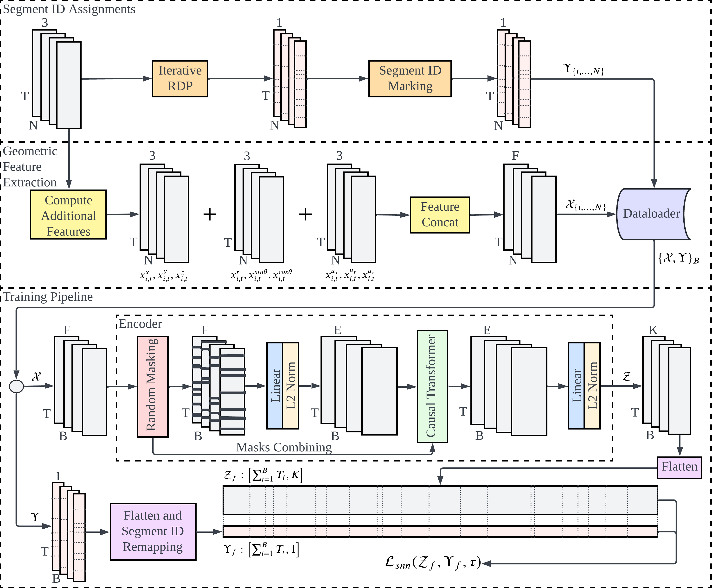
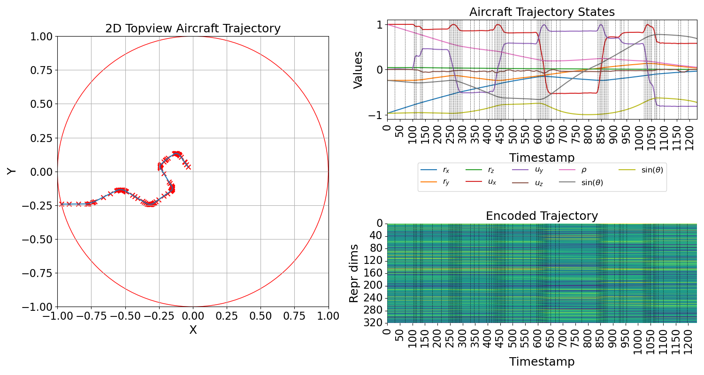

# ATSCC: Aircraft Trajectory Segmentation-based Contrastive Coding

ATSCC is a self-supervised time series representation for multivariate air traffic trajectory.
RDP
CLM
Geometric Feature

# Example embedding

